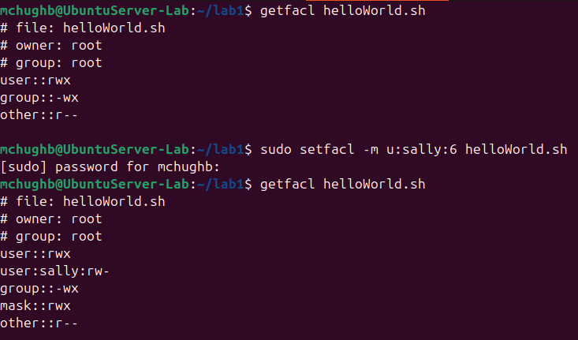

# Updating System

### 1.) When first starting the Ubuntu virtual machine I checked to see what updates from the apt package manager can be applied. 

### 2.) Next I updated and upgraded my Ubuntu install then rebooted the system. 

# User Management

### 1.) I switched to the root user to execute root commands without having to enter my password each time. You can see the terimal changed and has a # instead of a $.

### 2.) Next, I created two users. One with the useradd command and one with the adduser command.

As you can see the adduser command has extra functionality and allows for a more complete user setup.

### 3.) I switched to sally as the user. 

Now you can see sally@UbuntuServer-Lab.

### 4.) When trying to add a user as sally permission is denied.

This is because sally does not have root permissions. 

### 5.) I added the user earl with useradd. The -m flag adds a home directory for earl. Then, I deleted earl with userdel. The -r falg is a recursive delete.

### 6.) I then changed sally's password with the passwd command.

# Group Tasks

**For the rest of the tasks I will log out of the root user. It is risky to stay logged in as root because if you leave your computer unattended someone could do anything on your system without needing passwords.**

### 7.) After logging out of root I checked my user id with the id command.

Here you can see all of the groups mchughb belongs to:

    -user id: 1000
    -group id: 1000
    -adm
    -cdrom
    -sudo
    -dip
    -plugdev
    -users
    -lpadmin

### 8.) Next, I gave sally sudo privaledges and was then able to create a new user logged as her.

### 8.) I created a new group called cybersec and added sally to the group. I then checked what groups sally belonged to with the groups command

# Perminission and Access Control Lists

### 9.) I created a new directory called lab1 and checked the file permissions of the newely created directory with ls -ld lab1

Here you can see:

    -owner: mchughb
    -group owner: mchughb
    permissions:
        -owner: rwx
        -group: rwx
        -world: r-x

### 10.) Next, within the lab1 directory, I created a bash script to print hello world to the console.

I had to change the permissions so the script couble be executed with chmod +x.

### 11.) I checked the permissions for the helloWorld script. The owner had rwx but the group and world only had r--. I then added group write and execute permissions.

### 12.) getfacl and setfacl are utilies to see and see access control information for files and directories. First I used get facl to see the ACL of helloWorld.sh. Then I used setfacl to allow sally to read and write helloWorld.sh. 
