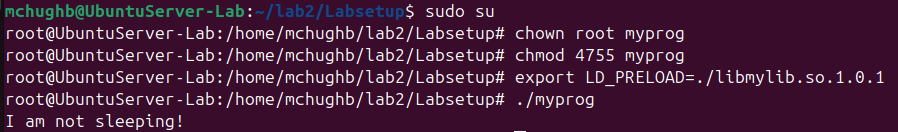
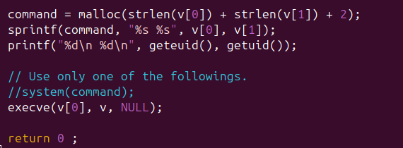
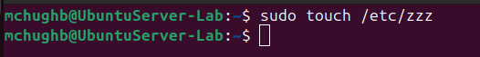
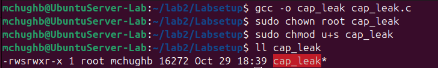
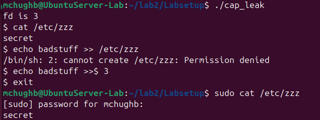

# Environment Variables

## Seeing Environment Variables

### To check the current environment variables one can use printenv or env. This outputs all the current environment variables for the system.

### To change environment variables one can use export or unset. 

- Here you can see I changed the shell from bash to sh.

## Parent and Child EV inheritance 

### Next I compiled and ran myprintenv.c and saved the output to file1. Then I commented the child process's env print and uncommented the parent's env print. Then I compiled and ran the file again, saving the output to file2. The using the diff command we can see the difference between the outputs.

- There is no difference between the outputs becuase parent and child processes have the same environment variables.

## Execve

### In this section I compiled and ran the myenv c program. When first running it the program outputs nothing. After changing the execve line to include the environ argument it then ouputs the environment variables.

- After chaning the NULL argument to environ in the execve line the program outputs the environment variables.

## System

### The System function is a vulnerability in C programs due to the way it executes system calls. It uses a sh shell to complete commands,  creating a potential attack vector. 

- Here I created a program that uses the system function to print the environment variables. 

## Set-UID

### Set-UID programs allows users to execute privaleged programs as a normal user. In this section I created a c file called uid_ev. This file simply prints the environment variables.

### I then changed the owner of the program to root and made it into a set-UID program.

### Next, I used the export command to change the PATH, LD_LIBRARY_PATH, and ANY_NAME environment variables.

### Then, I ran the set-UID program to see if the child process has the same environment variables.

- Using grep I can see that the PATH and ANY_NAME EV's were maintained but the LD_LIBRARY_PATH EV was not present.

## PATH EV and Set-UID

### Using a system() call in a set-UID program is quite risky as a bad actor could change the PATH EV and have the program perform unintended actions.

- Here I set the first path in the PATH EV as my own evil path.

### I then created a c program using system("ls") to list out the contents of a directory. In the evil directory I created another program called ls and in this one I had my "malicious code". 

- Becuse the system call did not specify an absolute path for the command it could be manipulated to use the ls program in my evil directory. The malicious program did not open a root shell due to countermeasures in Ubuntu.

## LD_PRELOAD

### By adding user defined libraries to the LD_PRELOAD one can force a program to look at these libraries before the standard libraries in linux. One can have a program call a user-defined function that performs unwanted actions. 

- I created a c file that has its own sleep function with an undesired output.

- Then, I compiled the program and added it to my shared libraries. 

- Next, I added my custom library to the LD_PRELOAD EV

- I created a c program that runs the expected sleep function.

- Running the program as a normal user outputs my user-defined sleep function.

- After making the program a set-UID program the expected sleep function was called due the dynamic linker countermeasures. The EUID != the RUID so the LD_PRELOAD library is ignored. 

- Changing the owner of the program to root and adding my custom library in the root shell printed my user-defined ouput. This is because the EUID == RUID so the LD_PRELOAD library is used. 

- After changing the owner to bob and exporting the LD_PRELOAD again in my user account, the expected sleep function was called. Bob and mchughb id's differ so the countermeasure was applied.

## System() vs Execve()
### it is risky to use system() in a privaledged pogram becuase it invokes a shell to execute commands. On the other hand, execve() does not invoke a shell and is therefore a safer alternative.

- This program provides privaledged cat access to files that a normal user cannot read. It either uses system() or execve() to execute the cat command. 

- I then made catall.c a setUID program and tried to read a file mchughb did not have read access to. The program was not able to read the file due to the countermeasures in place that check the EUID vs the RUID. In Ubuntu, set_UID programs de-escalate privaledge when the EUID does not match the RUID. Therefore another user like bob would not be able to remove a file that is not writable to them.

- I then commented the system() call and uncommented the execve command. 

- Then, I made the catall program root owned and a set-UID program again. This execve call is much more secure than the system() call so a bad actor would not be able to execute unwarranted commands. Execve() does not invoke a shell so there is no way a user could have their commands executed. 

## Capability Leaking
### After a set-UID program's privaledge is revoked, bad actors may still be able to execute unwanted commands via capability leaking. If a file descriptor is not closed in a program, then a user can inject commands into the file descriptor to exectute unwanted actions.

- First I created a file called zzz in the /etc/ directory. This file is owned by root and has 644 permission.  

- The cap_leak program uses a file descriptor to read /etc/zzz and then downgrades the privaledge to the RUID. It then executes a sh shell with execve().

- I ran cap_leak as a normal user and the program was able to cat zzz but it was not able to write to it directly. I then tried to to write to it using the file desctiptor but this was also unsucessful. This is likely due to the countermeasures in place.